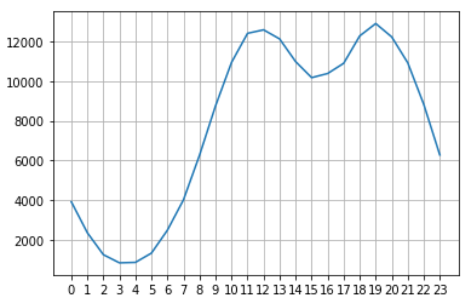
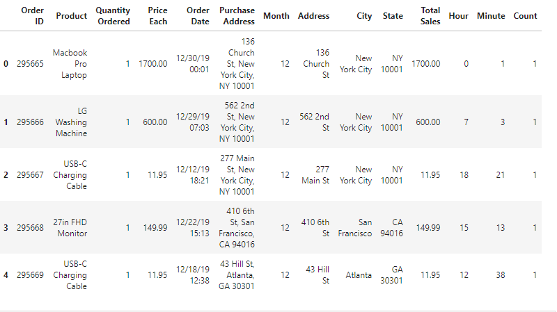
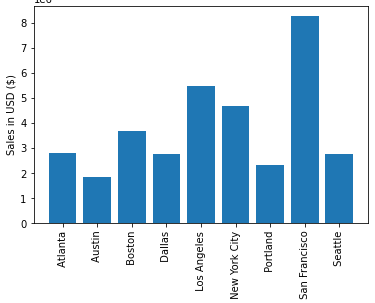
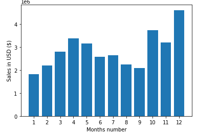
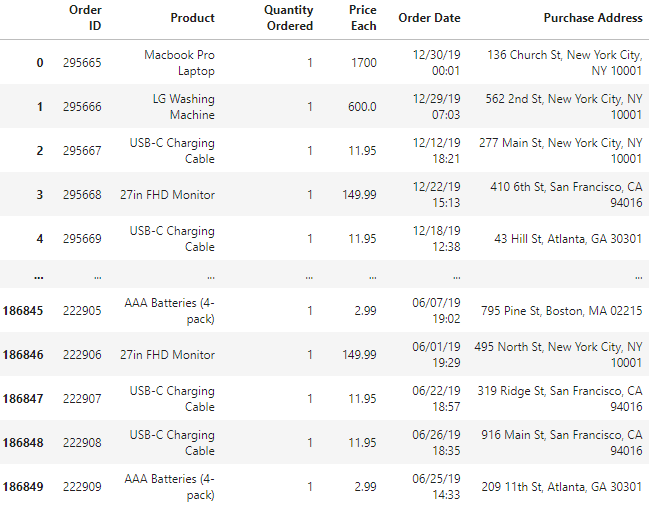
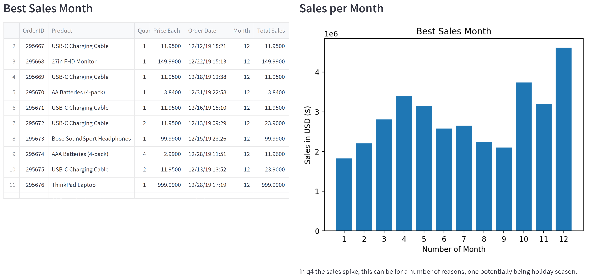
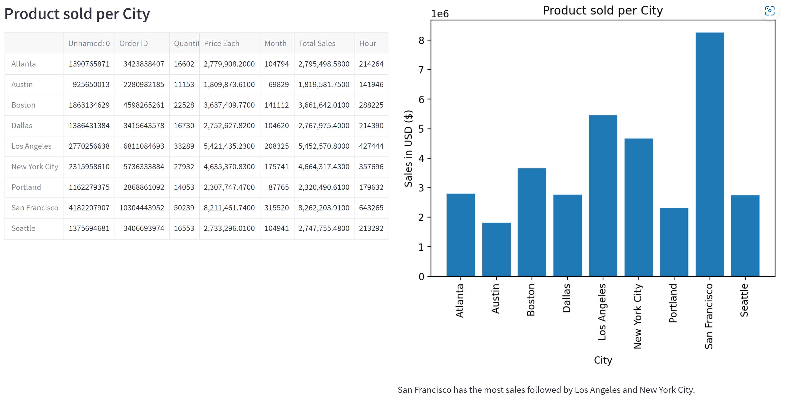
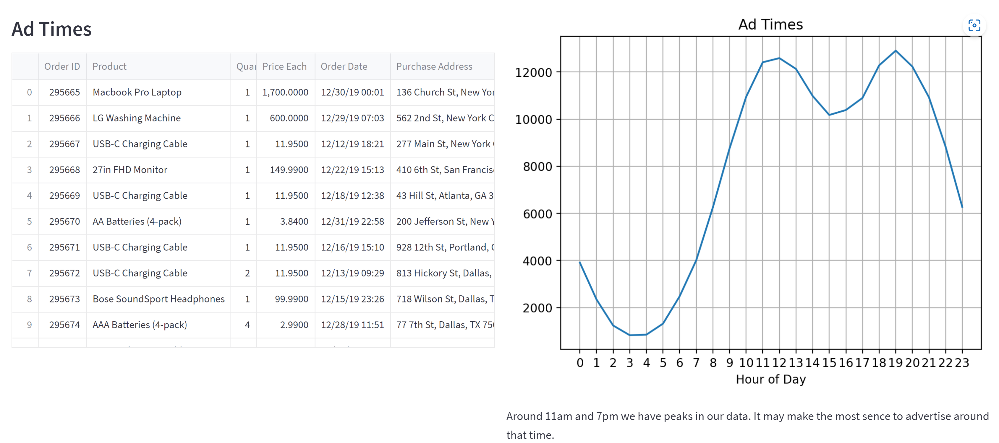

# Sales Analysis

## Background

A company has been tracking their sales for the year of 2019. At the end of the fisical year the company decided to upgrade tech from using Excel to a more optimal SQL-centric database.
 The data contains hundreds of thousands of electronics store purchases broken down by 'Order ID', 'Product', 'Quantity Ordered', 'Price Each', 'Order Date', 'Purchase Address'. Analyze the dataset and answer the following quesitons.

**CSV File:** [Sales Data](Images/sales.csv)

## Question 1: What was the best month for sales? How much was earned that month? Plot that in a bar chart.

## Question 2: What city sold the most product? Plot that in a bar chart.

## Question 3: What time should we display advertisements to maximize likelihood of customer's buying product? Plot that in a line chart.
 
---

**Libraries Used:** Pandas for data manipulation, Path for file directory, Matplotlib and Plotly for Visualization.

---

For this assignment, there are three main tasks:

1. [Read in and Wrangle Data](#Prepare-the-Data)

2. [Explore the data](#Data-Exploration-And-Visualization)

3. [Create a Custom Dashboard](#Create-a-Custom-Dashboard)

---

## Instructions

**File:** [Sales Analysis](./Sales_Analysis.ipynb)

### Prepare the Data

First, read and clean our CSV file for analysis. The CSV file includes hundreds of thousands of electronics store purchases broken down by 'Order ID', 'Product', 'Quantity Ordered', 'Price Each', 'Order Date', 'Purchase Address'.

1. Use Pandas to read the sales CSV file as a DataFrame. Dont forget to infer_datetime_format.

    * `sales.csv`: Contains the dataset we will be working with.

2. Detect and remove null values.
    sales_df.dropna(how='all', inplace=True)
    
3. Remove the text in the 'Order Date column' by taking the first 2 characters in the string and make that the month column. The months are being read in as 'Or' so make our month column numerical we need to simply state not equal to 'Or' 
    - sales_df[sales_df['Order Date'].str[0:2]!='Or']
    
        
4. Added 'Month', 'Address', 'City', 'State','Total Sales' columns to the dataset
    - Parsed cells as strings to make new columns (.str)
    - Apply the to_datetime(), to_numeric() and astype() functions to convert columns
    
---

### Data-Exploration-And-Visualization

Analyze the data to answer the following questions:

    - Question 1: What was the best month for sales? How much was earned that month? Plot that in a bar chart.

    - Question 2: What city sold the most product? Plot that in a bar chart.

    - Question 3: What time should we display advertisements to maximize likelihood of customer's buying product? Plot that in a line chart.
1. Use groupby() to perform aggregate analysis
2. Plot bar charts and lines graphs to visualize results
3. Be sure to clearly label graphs
    

### Create a Custom Dashboard

Streamlit Dashboard:
**File:** [Sales Analysis Dashboard](./Sales_Analysis_Dashboard.py)

**View the Streamlit application**
Run the Streamlit application to view a completed Sales Analysis Dashboard. To do so, complete the following steps:

1. In the terminal, navigate to the projects folder.
2. In the terminal, run the Streamlit application by using streamlit run "Sales_Analysis_Dashboard.py"

### Answers

- Question 1: In Q4 the sales spiked, this can be for a number of reasons, one potentially being the holiday season.
- Question 2: San Francisco has the most sales followed by Los Angeles and New York City.
- Question 3: Around 11am and 7pm, peaks can be observed in our data. It may make the most sence to advertise around that time.

---

## Resources

* [Pandas API Docs](https://pandas.pydata.org/pandas-docs/stable/reference/index.html)

* [Functions in Pandas](https://pandas.pydata.org/pandas-docs/stable/reference/api/pandas.DataFrame.html)

* [Matplotlib API Docs](https://matplotlib.org/stable/api/index.html)

* [plotly.express API Docs](https://plotly.com/python-api-reference/plotly.express.html)

---

## Hints

* The CSV file contains multiple headers throughout the dataset.

* Be sure to use `head()` or `sample()` when you want to look at your data, but don't want to print to a large DataFrame.

## Appendix

* 
* 
* 
* 
* 
* 
* 
* 
* 
